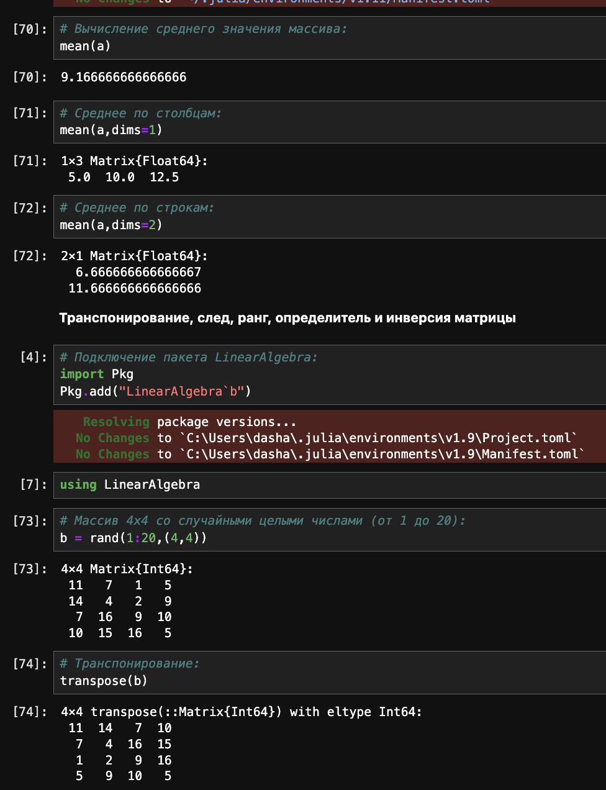
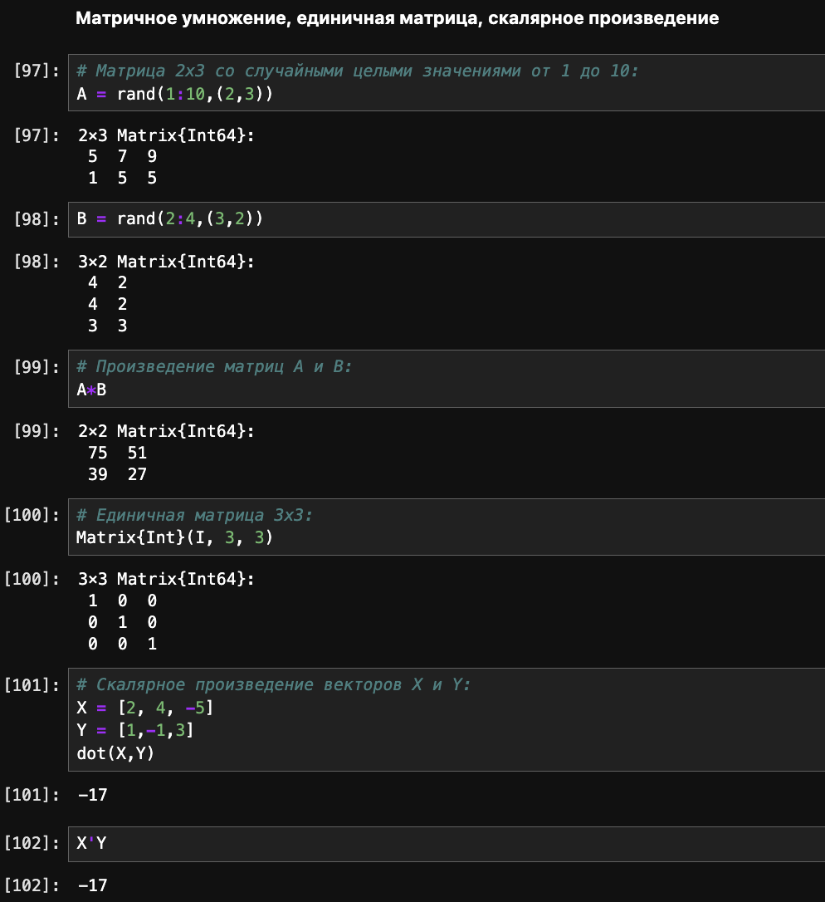
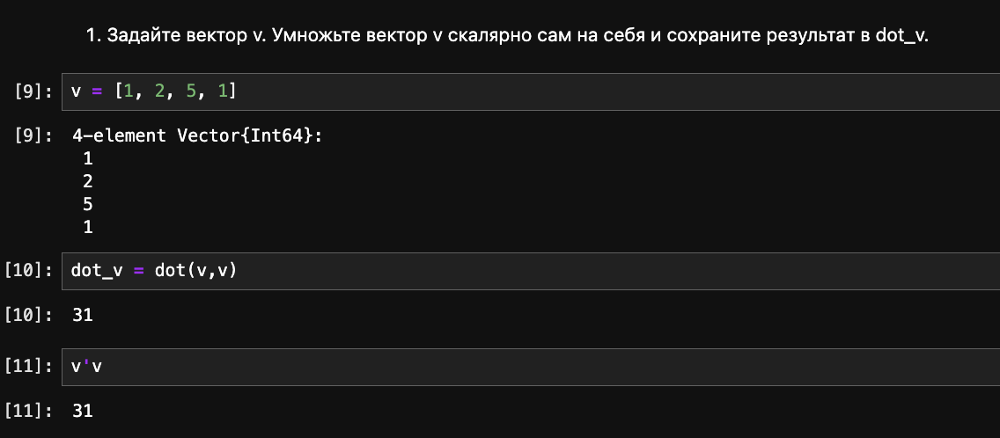
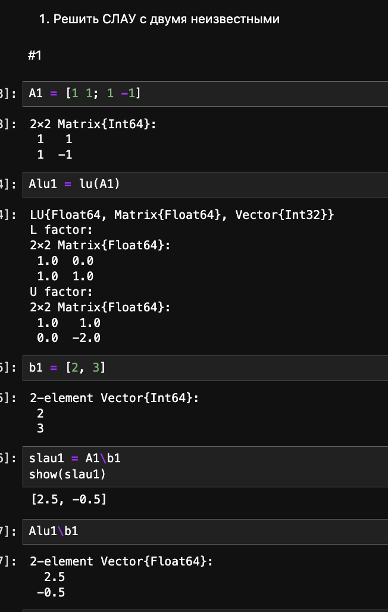
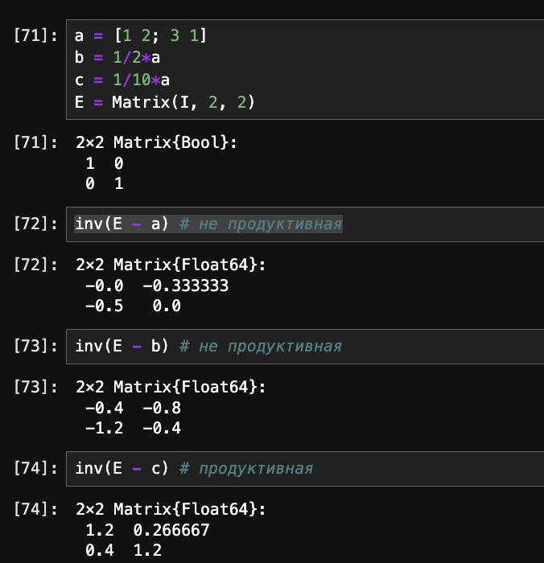

---
## Front matter
lang: ru-RU
title: Лабораторная работа № 4
subtitle: Линейная алгебра
author:
  - Беличева Д. М.
institute:
  - Российский университет дружбы народов, Москва, Россия

## i18n babel
babel-lang: russian
babel-otherlangs: english

## Formatting pdf
toc: false
toc-title: Содержание
slide_level: 2
aspectratio: 169
section-titles: true
theme: metropolis
header-includes:
 - \usepackage{fontspec}
 - \setmainfont{FreeSerif}
 - \setsansfont{FreeSans}
 - \metroset{progressbar=frametitle,sectionpage=progressbar,numbering=fraction}
---

# Информация

## Докладчик

:::::::::::::: {.columns align=center}
::: {.column width="70%"}

  * Беличева Дарья Михайловна
  * студентка
  * Российский университет дружбы народов
  * [1032216453@pfur.ru](mailto:1032216453@pfur.ru)
  * <https://dmbelicheva.github.io/ru/>

:::
::: {.column width="25%"}

:::
::::::::::::::

## Цель работы

Основной целью работы является изучение возможностей специализированных пакетов Julia для выполнения и оценки эффективности операций над объектами линейной
алгебры.

## Задание

1. Используя JupyterLab, повторите примеры.
2. Выполните задания для самостоятельной работы.

## Выполнение лабораторной работы

{#fig:001 width=30%}

## Выполнение лабораторной работы

{#fig:002 width=30%}

## Выполнение лабораторной работы

{#fig:003 width=40%}

## Выполнение лабораторной работы

{#fig:004 width=40%}

## Выполнение лабораторной работы

{#fig:005 width=30%}

## Выполнение лабораторной работы

{#fig:006 width=35%}

## Выполнение лабораторной работы

{#fig:007 width=40%}

## Выполнение лабораторной работы

{#fig:008 width=40%}

## Задания для самостоятельного выполнения

{#fig:009 width=70%}

## Задания для самостоятельного выполнения

{#fig:010 width=70%}

## Задания для самостоятельного выполнения

{#fig:011 width=25%}

## Задания для самостоятельного выполнения

{#fig:012 width=25%}

## Задания для самостоятельного выполнения

{#fig:013 width=25%}

## Задания для самостоятельного выполнения

{#fig:014 width=25%}

## Задания для самостоятельного выполнения

{#fig:015 width=40%}

## Задания для самостоятельного выполнения

{#fig:016 width=50%}

## Задания для самостоятельного выполнения

{#fig:017 width=40%}

## Задания для самостоятельного выполнения

{#fig:018 width=40%}

## Выводы

В процессе выполнения данной лабораторной работы я изучила возможности специализированных пакетов Julia для выполнения и оценки эффективности операций над объектами линейной
алгебры.

## Список литературы

1. JuliaLang[Электронныйресурс].2024JuliaLang.orgcontributors.URL:https://julialang.org/(датаобращения:11.10.2024).
2. Julia 1.11 Documentation [Электронный ресурс]. 2024 JuliaLang.orgcontributors. URL: https://docs.julialang.org/en/v1/ (дата обращения:11.10.2024)
